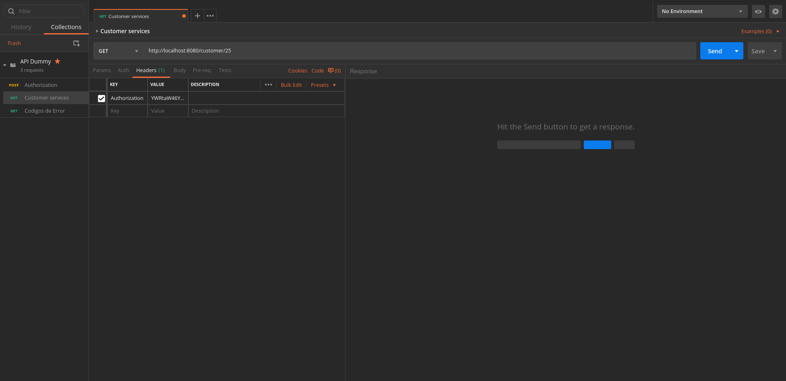

# Proof of concept for apache's HTTP Lua module

- [Proof of concept for apache's HTTP Lua module](#proof-of-concept-for-apaches-http-lua-module)
  - [Requirements](#requirements)
  - [Running the POC](#running-the-poc)

This POC trying to proof that the apache's HTTP Lua module can be used in a Reverse Proxy to control the access to internal resources. 

## Requirements

- Docker version 19 (Required)
- docker-compose version 1.22 (Required)
- Postman version 7 (Required)
- Linux (Optional)

## Running the POC

To start the sample application you must execute the following sentence (For Linux).

```shell
docker-compose up -d && docker-compose logs -f
```

When the logs stop to writing to standard output. You will have access to the REST API used to proof the access control.

You can use the following [Postman collection](doc/API_Dummy.postman_collection.json) to test the API.

With the collection imported, you can test the API such as shown in the gif:

